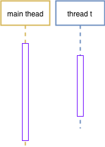

# C++11多线程-线程局部存储(thread_local)
线程局部存储在其它语言中都是以库的形式提供的(库函数或类)。但在C++11中以关键字的形式，做为一种存储类型出现，由此可见C++11对线程局部存储的重视。C++11中有如下几种存储类型:
<table>
<tr><td>序号</td><td>类型</td><td>备注</td></tr>
<tr><td>1</td><td>auto<font color="gray">(C++11)</font></td><td>该关键字用于两种情况：<br/>1. 声明变量时： 根据初始化表达式自动推断变量类型。<br/>2. 声明函数作为函数返回值的占位符。</td></tr>
<tr><td>2</td><td>static</td><td>static本质上是创建“全局变量”，该变量只初始化一次，除此之外它还会控制变量的可见性：<br/>1. static修饰函数内的“局部”变量时，表明它不需要在进入或离开函数时创建或销毁。且仅在函数内可见。<br/>2. static修饰全局变量时，表明该变量仅在当前(声明它的)文件内可见。<br/>3. static修饰类的成员变量时，则该变量被该类的所有实例共享。</td></tr>
<tr><td>3</td><td>register</td><td>寄存器变量。该变量存储在CPU寄存器中，而不是RAM(栈或堆)中。该变量的最大尺寸等于寄存器的大小。由于是存储于寄存器中，因此不能对该变量进行取地址操作。</td></tr>
<tr><td>4</td><td>extern</td><td>引用一个全局变量。当在一个文件中定义了一个全局变量时，就可以在其它文件中使用extern来声明并引用该变量。</td></tr>
<tr><td>5</td><td>mutable</td><td>仅适用于类成员变量。以mutable修饰的成员变量可以在const成员函数中修改。参见上一章chan.simple.h中对mutex的使用。</td></tr>
<tr><td>6</td><td>thread_local<font color="gray">(C++11)</font></td><td>线程周期</td></tr>
</table>
thread_local修饰的变量具有线程周期。变量在线程创建时生成(不同编译器实现略有差异，但在线程内变量第一次使用前必然已构造完毕)，线程结束时被销毁(析构)。每个线程都拥有其自己的变量副本。thread_local可以和static或extern联合使用，这将会影响变量的链接属性。
下面代码演示了thread_local变量在线程中的生命周期

```c++
// thread_local.cpp
#include <iostream>
#include <thread>

class A {
public:
  A() {
    std::cout << std::this_thread::get_id()
              << " " << __FUNCTION__
              << "(" << (void *)this << ")"
              << std::endl;
  }
  ~A() {
    std::cout << std::this_thread::get_id()
              << " " << __FUNCTION__
              << "(" << (void *)this << ")"
              << std::endl;
  }

  // 线程中，第一次使用前初始化
  void doSth() {
  }
};

thread_local A a;
int main() {
  a.doSth();

  std::thread t([]() {
    std::cout << "Thread: "
              << std::this_thread::get_id()
              << " entered" << std::endl;
    a.doSth();
  });

  t.join();

  return 0;
}
```
运行该程序

```
$> g++ -std=c++11 -o debug/tls.out ./thread_local.cpp
$> ./debug/tls.out
0x11780a5c0 A(0x7febdfc00720)
Thread: 0x70000645c000 entered
0x70000645c000 A(0x7febdfc02ee0)
0x70000645c000 ~A(0x7febdfc02ee0)
0x11780a5c0 ~A(0x7febdfc00720)
$>
```
a在nain线程和t线程中分别保留了一份副本，以下时序图表明了两份副本的生命周期。<br/>

