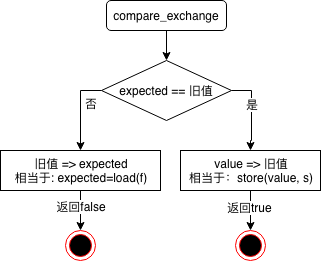

# C++11多线程-原子操作(2)
[上一篇](c0da859a7ce0)我们介绍了原子操作中最简单的std::atomic_flag，今天我们看一下std::atomic<T>类。
## 2. std::atomic\<T\>
std::atomic是一个模板类，它定义了一些atomic应该具有的通用操作，我们一起来看一下:
### 2.1 is_lock_free
```c++
bool is_lock_free() const noexcept;
bool is_lock_free() const volatile noexcept;
```
atomic是否无锁操作。如果是，则在多个线程访问该对象时不会导致线程阻塞(可能使用某种事务内存transactional memory方法实现lock-free的特性)。
事实上该函数可以做为一个静态函数。所有指定相同类型T的atomic实例的is_lock_free函数都会返回相同值。
### 2.2 store
```c++
void store(T desr, memory_order m = memory_order_seq_cst) noexcept;
void store(T desr, memory_order m = memory_order_seq_cst) volatile noexcept;
T operator=(T d) noexcept;
T operator=(T d) volatile noexcept;
```
赋值操作。operator=实际上内部调用了store，并返回d。
```c++
T operator=(T d) volatile noexpect {
    store(d);
    return d;
}
```
**注**：有些编译器，在实现store时限定m只能取以下三个值：memory_order_consume，memory_order_acquire，memory_order_acq_rel。
### 2.3 load
```c++
T load(memory_order m = memory_order_seq_cst) const volatile noexcept;
T load(memory_order m = memory_order_seq_cst) const noexcept;
operator T() const volatile noexcept;
operator T() const noexcept;
```
读取，加载并返回变量的值。operator T是load的简化版，内部调用的是load(memory_order_seq_cst)形式。
### 2.4 exchange
```c++
T exchange(T desr, memory_order m = memory_order_seq_cst) volatile noexcept;
T exchange(T desr, memory_order m = memory_order_seq_cst) noexcept;
```
交换，赋值后返回变量赋值前的值。exchange也称为read-modify-write操作。
### 2.5 compare_exchange_weak
```c++
bool compare_exchange_weak(T& expect, T desr, memory_order s, memory_order f) volatile noexcept;
bool compare_exchange_weak(T& expect, T desr, memory_order s, memory_order f) noexcept;
bool compare_exchange_weak(T& expect, T desr, memory_order m = memory_order_seq_cst) volatile noexcept;
bool compare_exchange_weak(T& expect, T desr, memory_order m = memory_order_seq_cst) noexcept;
```
这就是有名的[CAS(Compare And Swap: 比较并交换)](https://en.wikipedia.org/wiki/Compare-and-swap)。但C++11针对该操作提供了更多的细节，其操作流程如下：

以上只是个示意图，compare_exchange_weak操作是原子的，排它的。其它线程如果想要读取或修改该原子对象时，会等待先该操作完成。
该函数**直接比较原子对象所封装的值与expect的物理内容**，在某些情况下，对象的比较操作在使用 operator==() 判断时相等，但 compare_exchange_weak 判断时却可能失败，因为对象底层的物理内容中可能存在位对齐或其他逻辑表示相同但是物理表示不同的值(比如 true 和 5，它们在逻辑上都表示"真"，但在物理上两者的表示并不相同)。
与strong版本不同，weak版允许返回**伪false**，即使原子对象所封装的值与expect的物理内容相同，也仍然返回false。但它在某些平台下会取得更好的性能，在某些循环算法中这种行为也是可接受的。对于非循环算法建议使用compare_exchange_strong。
### 2.6 compare_exchange_strong
```c++
bool compare_exchange_strong(T& expect, T desr, memory_order s, memory_order f) volatile noexcept;
bool compare_exchange_strong(T& expect, T desr, memory_order s, memory_order f) noexcept;
bool compare_exchange_strong(T& expect, T desr, memory_order m = memory_order_seq_cst) volatile noexcept;
bool compare_exchange_strong(T& expc, T desr, memory_order m = memory_order_seq_cst) noexcept;
```
compare_exchange的strong版本，进行compare时，与weak版一样，都是比较的物理内容。与weak版不同的是，strong版本不会返回伪false。即：原子对象所封装的值如果与expect在物理内容上相同，strong版本一定会返回true。其所付出的代价是：在某些需要循环检测的算法，或某些平台下，其性能较compare_exchange_weak要差。但对于某些不需要采用循环检测的算法而言, 通常采用compare_exchange_strong 更好。

## 3. std::atomic特化
我知道计算擅长处理整数以及指针，并且X86架构的CPU还提供了指令级的CAS操作。C++11为了充分发挥计算的特长，针对数值(std::atmoic\<integral\>)及指针(std::atomic\<T*\>)进行了特化，以提高原子操作的性能。特化后的atomic在通用操作的基础上，还提供了更丰富的功能。
### 3.1 fetch_add
```c++
// T is integral
T fetch_add(T v, memory_order m = memory_order_seq_cst) volatile noexcept;
T fetch_add(T v, memory_order m = memory_order_seq_cst) noexcept;
// T is pointer
T fetch_add(ptrdiff_t v, memory_order m = memory_order_seq_cst) volatile noexcept;
T fetch_add(ptrdiff_t v, memory_order m = memory_order_seq_cst) noexcept;
```
该函数将原子对象封装的值加上v，同时返回原子对象的旧值。其功能用伪代码表示为：
```c++
auto old = contained
contained += v
return old
```
其中contained为原子对象封装值，本文后面均使用contained代表该值。**注：** 以上是为了便于理解的伪代码，实际实现是原子的不可拆分的。
### 3.2 fetch_sub
```c++
// T is integral
T fetch_sub(T v, memory_order m = memory_order_seq_cst) volatile noexcept;
T fetch_sub(T v, memory_order m = memory_order_seq_cst) noexcept;
// T is pointer
T fetch_sub(ptrdiff_t v, memory_order m = memory_order_seq_cst) volatile noexcept;
T fetch_sub(ptrdiff_t v, memory_order m = memory_order_seq_cst) noexcept;
```
该函数将原子对象封装的值减去v，同时返回原子对象的旧值。其功能用伪代码表示为：
```c++
auto old = contained
contained -= v
return old
```
### 3.3 ++, --, +=, -=
不管是基于整数的特化，还是指针特化，atomic均支持这四种操作。其用法与未封装时一样，此处就不一一列举其函数原型了。
## 4 独属于数值型特化的原子操作 - 位操作
### 4.1 fetch_and，fetch_or，fetch_xor
位操作，将contained按指定方式进行位操作，并返回contained的旧值。
```c++
integral fetch_and(integral v, memory_order m = memory_order_seq_cst) volatile noexcept;
integral fetch_and(integral v, memory_order m = memory_order_seq_cst) noexcept;
integral fetch_or(integral v, memory_order m = memory_order_seq_cst) volatile noexcept;
integral fetch_or(integral v, memory_order m = memory_order_seq_cst) noexcept;
integral fetch_xor(integral v, memory_order m = memory_order_seq_cst) volatile noexcept;
integral fetch_xor(integral v, memory_order m = memory_order_seq_cst) noexcept;
```
以xor为例，其操作相当于
```c++
auto old = contained
contained ^= v
return old
```
### 4.2 operator &=，operator |=，operator ^=
与相应的fetch_*操作不同的是，operator操作返回的是新值:
```c++
T operator &=(T v) volatile noexcept {return fetch_and(v) & v;}
T operator &=(T v) noexcept {return fetch_and(v) & v;}
T operator |=(T v) volatile noexcept {return fetch_or(v) | v;}
T operator |=(T v) noexcept {return fetch_or(v) | v;}
T operator ^=(T v) volatile noexcept {return fetch_xor(v) ^ v;}
T operator ^=(T v) noexcept {return fetch_xor(v) ^ v;}
```
## 5. std::atomic的限制: trivial copyable
上面我们提到std::atomic提供了通用操作，其实这些操作可以应用到所有**trivially copyable**的类型。从字面意义理解，一个类型如果是拷贝不变的(**trivially copyable**)，则使用memcpy这种方式把它的数据从一个地方拷贝出来会得到相同的结果。编译器如何判断一个类型是否**trivially copyable**呢？C++标准把trivial类型定义如下，一个拷贝不变(**trivially copyable**)类型是指：
  1. 没有non-trivial 的拷贝构造函数
  2. 没有non-trivial的move构造函数
  3. 没有non-trivial的赋值操作符
  4. 没有non-trivial的move赋值操作符
  5. 有一个trivial的析构函数

一个trivial class类型是指有一个trivial类型的默认构造函数，而且是拷贝不变的(**trivially copyable**)的class。**特别注意，拷贝不变类型和trivial类型都不能有虚机制**。那么trivial和non-trivial类型到底是什么呢？这里给出一个非官方、不严谨的判断方式，方便大家对**trivially copyable**有一个直观的认识。一个**trivial copyable**类在四个点上没有自定义动作，也没有编译器加入的额外动作(如虚指针初始化就属额外动作)，这四个点是:
  * 缺省构造。*类必须支持缺省构造*，同时类的非静态成员也不能有自定义或编译器加入的额外动作，否则编译器势必会隐式插入额外动作来初始化非静态成员。
  * 拷贝构造、拷贝赋值
  * move构造、move赋值
  * 析构

为了加深理解，我们来看一下下面的例子(所有的类都是trivial的)：
```c++
// 空类
struct A1 {};

// 成员变量是trivial的
struct A2 {
    int x;
};

// 基类是trivial的
struct A3 : A2 {
    // 非用户自定义的构造函数(使用编译器提供的default构造)
    A3() = default;
    int y;
};

struct A4 {
    int a;
private: // 对防问限定符没有要求，A4仍然是trivial的
    int b;
};

struct A5 {
    A1 a;
    A2 b;
    A3 c;
    A4 d;
};

struct A6 {
    A2 a[16];
};

struct A7 {
    A6 c;
    void f(); // 普通成员函数是允许的
};

struct A8 {
     int x;
    // 对静态成员无要求(std::string是non-trivial的)
     static std::string y;
};

struct A9 {
    // 非用户自定义
    A9() = default;
    // 普通构造函数是可以的(前提是我们已经有了非定义的缺省构造函数)
    A9(int x) : x(x) {};
    int x;
};
```
而下面这些类型都是non-trivial的
```c++
struct B {
    // 有虚函数(编译器会隐式生成缺省构造，同时会初始化虚函数指针)
    virtual f();
};

struct B2 {
    // 用户自定义缺省构造函数
    B2() : z(42) {}
    int z;
};

struct B3 {
    B3();
    int w;
};
// 虽然使用了default，但在缺省构造声明处未指定，因此被判断为non-trivial的
NonTrivial3::NonTrivial3() = default;

struct B4 {
   // 虚析构是non-trivial的
    virtual ~B4();
};
```
STL在其头文件<type_traits>中定义了对**trivially copyable**类型的检测：
```c++
template <typename T>
struct std::is_trivially_copyable;
```
判断类A是否trivially_copyable:```std::is_trivially_copyable<A>::value```，该值是一个const bool类型，如果为true则是**trivially_copyable**的，否则不是。
