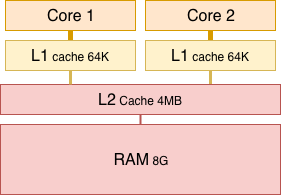
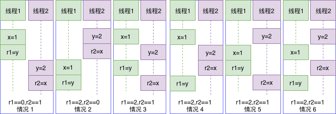
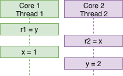
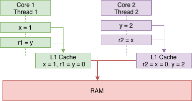
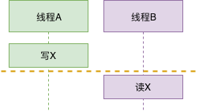

# C++11多线程-内存模型
我们在前面讲atomic时，每一个原子操作都有一个std::memory_order参数。这个参数就是C++11的内存模型，用于确定该原子操作以什么样的方式进行读取。在atomic_flag中我们简单的对std::memory_order模型做了解释，本节我们再来深入了解一下。
# 一、内存模型分类
一般来说，内存模型可分为静态内存模型和动态内存模型。
 1. **静态内存模型**主要是类(或结构)对象在内存中的布局。也就是类(或结构)成员在内存中是如何存放的。类(或结构)对象的内存布局请参考[Stanley B.Lippman](https://en.wikipedia.org/wiki/Stanley_B._Lippman)的《深度探索C++对象模型》。
 2. **动态内存模型**是从行为方面来看，多个线程对同一个对象同时读写时所做的约束，该模型理解起来要复杂一些，涉及了内存、Cache、CPU各个层次的交互，尤其是在多核系统中为了保证多线程环境下执行的正确性，需要对读写事件加以严格限制。std::memory_order就是这用来做这事的，它实际上是程序员、编译器以及CPU之间的契约，遵守契约后大家各自优化，从而可能提高程序性能。
# 二、为什么需要内存模型
理解动态内存模型需要对现代处理器架构有一定的了解，因为它表示机器指令是以什么样的顺序被处理器执行的 (现代的处理器不是逐条处理机器指令的)。



上图是一个典型的多核CPU系统架构，具有双CPU核，每个核有一个私有的64K的一级缓存，两核共享4MB的二级缓存以及8G内存。该架构下数据并不是CPU<-->RAM直接读写，而是要经过L1和L2。写时CPU写入L1 Cache中，再从L1存入RAM中。读时也是，先从L1中读，读不到再从RAM中读。上图中离CPU越近的Cache读写性能越高，这可以有效提高数据的存取效率，但在一些特殊情况下会导致程序出错，看下面的例子(初值：x=y=0)：
|线程1|线程2
|---|---
x = 1;<br/>r1 = y;|y=2;<br/>r2 = x;
在编译器、CPU不对指令进行重排，且两个线程交织执行(假设以上四条语句都是原子操作)时共有4!/(2!*2!)=6种情况：



r1和r2的最终结果共有3种，分别是:
 * r1==0,r2==1: 情况1
 * r1==2,r2==0: 情况2
 * r1==2,r2==1: 情况3、4、5、6

表面上看，r1== r2 == 0的情况不可能出现。但是当四条语句不是原子操作时。有一种可能是Core1的指令预处理单元看到线程1的两条语句没有依赖性(不管哪条语句先执行，在两条指令语句完成后都会得到一样的结果)，会先执行r1=y再执行x=1，或者两条指令同时执行，这就是CPU的多发射和乱序执行。Core2也一样。这样一来就有可能出来r1==r2==0的结果。



另一种可能是缓存不一致。当Core1和Core2都将x,y更新到L1 Cache中，而还未来得及更新到RAM时，两个线程都已经执行完了第二条语句，此时r1==r2==0。



从编译器层面也一样，为了获取更高的性能，也可能会对语句进行执行顺序上的优化(类似CPU乱序)。

在编译器优化+CPU乱序+缓存不一致的多重组合下，情况不止以上三种。但不管哪一种，都不是我们希望看到的。那么如何避免呢？最简单的，也是首选的，方案当然是std::mutex。大牛陈硕曾说过：
> 一个使用普通mutex的多线程程序，如果写错了，一般程序员，比如我，很容易分析出错误在哪——无非是漏了加锁，或者加锁次序错乱——并加以改正。如果用原子操作，除了最简单的 atomic counter，如果写错了，你能通过读代码找出错误吗？反正我是不能。换言之，你如何证明这一段代码是正确的？reasoning 难多了。

但是当程序对代码执行效率要求很高，std::mutex不满足时，就需要std::atomic上场了。
# 三、C++11的内存模型
在正式介绍memory_order之前，我们先来看两个概念：synchronized-with和happends-before。
 * 行为：**synchronized-with**。
这是std::atomic生效的前提之一。假设X是一个atomic变量。如果线程A写了变量X, 线程B读了变量X，那么我们就说线程A、B间存在synchronized-with关系。C++11默认的原子操作(memory_order_seq_cst)就是synchronized-with的，保证了对X的读和写是互斥的，不会同时发生。



* 结果：**happens-before**。
happens-before指明了后发生的动作会看到先发生的动作的结果。还是上图，当线程B读取X时，读到的一定是写入后的X值，而不会是其它情况。happends-before具有*传递性*。如果A happens-before B，B happens-before C，那么A happends-before C。

概念介绍完了，下面来看看C++11为std::atomic提供的memory order:
```c++
enum class memory_order {
    memory_order_relaxed,
    memory_order_consume,  // since C++20, load-consume
    memory_order_acquire,  // load-acquire
    memory_order_release,  // store-release
    memory_order_acq_rel,  // store-release load-acquire
    memory_order_seq_cst   // store-release load-acquire
};
```
虽然枚举定义了6个，但它们表示的是4种内存模型:

|序号|内存模型|memory_order值|备注
|:-:|:-:|----|--
|1|宽松|memory_order_relaxed|
|2|释放-获取|memory_order_acquire<br/>memory_order_release<br/> memory_order_acq_rel|
|3|释放-消费|memory_order_consume|C++20起
|4|顺序一致|memory_order_seq_cst|默认内存序

这些不同的内存序模型在不同的CPU架构下会有不同的代价。这允许专家通过采用更合理的内存序获得更大的性能升；同时允许在对性能要求不是那么严格的环境中采用默认的内存序，使得程序更容易理解。

## 3.1 宽松次序(relaxed ordering)
在原子变量上采用relaxed ordering的操作不参与synchronized-with关系，无同步操作，它们不会在内存并发访问时强加顺序。Relaxed order只是保证了原子性和修改顺序的一致性。在同一线程内对**同一原子变量**的操作不可以被重排，仍保持happens-before关系，但这与别的线程无关。尽管如此，relaxed ordering操作仍然是原子的，其值不会因为多线程而被破坏。先看看一个简单的例子：
```c++
std::atomic<int> x{0}, y{0};

void thread_1() {
    auto r1 = y.load(std::memory_order_relaxed);  // A
    x.store(r1, std::memory_order_relaxed);  // B
}
void thread_2() {
    auto r2 = x.load(std::memory_order_relaxed); // C
    y.store(42, std::memory_order_relaxed);  // D
}
```
执行完上面的程序，可能出现r1 == r2 == 42。理解这一点并不难，因为编译器允许调整C和D的执行顺序。如果程序的执行顺序是 D -> A -> B -> C，那么就会出现r1 == r2 == 42。

Relaxed ordering适用于**只要求原子操作，不需要其它同步保障**的情况。该操作典型的应用场景是程序计数器：
```c++
#include <cassert>
#include <thread>
#include <atomic>

std::atomic<int> cnt{0};
void f()
{
    for (int n = 0; n < 1000; ++n) {
        cnt.fetch_add(1, std::memory_order_relaxed);
    }
}
int main()
{
    std::thread threads[10];
    for (std::thread &thr: threads) {
        thr = std::thread(f);
    }
    for (auto &thr : v) {
        thr.join();
    }
    assert(cnt == 10000); // 永远不会失败
    return 0;
}
```
## 3.2 释放-获取次序(release-acquire ordering)
Release-acquire中没有全序关系，但它提供了一些同步方法。在这种序列模型下，原子操作对应的内存序为：

|序号|原子操作|对应的内存操作|memory_order枚举值
|:--:|:--:|---|----
|1|load|acquire|memory_order_acquire
|2|store|release|memory_order_release
|3|fetch_add<br/>exchange|acquire<br>或 release<br>或 两者都是|memory_order_acquire<br/>memory_order_release<br/>memory_order_acq_rel
|...|...|...|...

Release-acquire中同步是成对出现的，仅建立在释放和获取同一原子对象的线程之间。其它线程有可能看到不一样的内存访问顺序。在我们常用的x86系统(强顺序系统)上，释放-获取顺序对于多数操作是自动进行的，无需为此同步模式添加额外的CPU指令。但在弱顺序系统(如ARM)上，必须使用特别的CPU加载或内存栅栏指令。

Release-acquire有一个特点：线程A中所有发生在release x之前的写操作(包括非原子或宽松原子)，对在线程B acquire x之后都可见。本来A、B间读写操作顺序不定。这么一同步，在x这个点前后，A、B线程之间有了个顺序关系，称作inter-thread happens-before。

一个释放-获取同步的例子是std::mutex：线程A释放锁而线程B获得它时，发生于线程A环境的临界区(释放之前)中的所有内存写入操作，对于线程B(获得之后)均可见。下面我们来看一个释放-获取的例子：
```c++
#include <thread>
#include <atomic>
#include <cassert>
#include <string>
 
std::atomic<std::string*> ptr;
int data;
 
void producer()
{
    std::string* p  = new std::string("Hello");
    data = 42;
    // 这句要放在最后，目的是为了在consumer中看到data的副带效应
    ptr.store(p, std::memory_order_release);
}
 
void consumer()
{
    std::string* p2;
    while (!(p2 = ptr.load(std::memory_order_acquire))) {
        ;
    }
    // 下面的两个断言永远为真
    assert(*p2 == "Hello");
    // producer中执行store之前的操作，在这里也可以看到
    assert(data == 42);
}
 
int main()
{
    std::thread t1(producer);
    std::thread t2(consumer);
    t1.join();
    t2.join();
}
```
根据happens-before，可以知道释放-获取次序是可以传递的，在更多线程下仍然有效。
## 3.3 释放-消费次序(release-consume ordering)
释放-消费顺序的规范正在修订中，C++标准暂不鼓励使用memory_order_consume。此处不过多介绍。
## 3.4 顺序一致性次序(sequential-consisten ordering)
顺序一致性原子操作可以看作是释放-获取操作的加强版，它与释放-获取顺序相同的方式排序内存(在一个线程中先发生于存储的任何结果都变成进行加载的线程中的可见副效应)的同时，还对所有内存操作建立单独全序。

换个说法。Release-acquire只针对一个变量x的原子操作进行同步，而Sequential-consisten则是对所有使用memory_order_seq_cst的原子操作进行同步。这么一来所有的使用memory_order_seq_cst的原子操作就跟由一个线程顺序执行似的。

顺序一致性次序是std::atomic的默认内存序，它意味着将程序看做是一个简单的序列。如果对于一个原子变量的所有操作都是顺序一致的，那么多线程程序的行为就像是这些操作都以一种特定顺序被单线程程序执行。从同步的角度来看，一个顺序一致的store操作会与load操作同步。顺序模型还保证了在load之后执行的顺序一致原子操作都得表现得在store之后完成。

顺序一致性模型在所有多核系统上要求完全的内存栅栏CPU指令。这可能成为性能瓶颈，因为它强制受影响的内存访问传播到每个核心。

此示例演示顺序一致次序为必要的场合。任何其他次序都可能触发assert，因为可能令线程c和d观测到原子对象x和y以相反顺序更改。
```c++
#include <thread>
#include <atomic>
#include <cassert>
 
std::atomic<bool> x = {false};
std::atomic<bool> y = {false};
std::atomic<int> z = {0};
 
void write_x()
{
    x.store(true, std::memory_order_seq_cst);
}
 
void write_y()
{
    y.store(true, std::memory_order_seq_cst);
}
 
void read_x_then_y()
{
    while (!x.load(std::memory_order_seq_cst))
        ;
    if (y.load(std::memory_order_seq_cst)) {
        ++z;
    }
}
 
void read_y_then_x()
{
    while (!y.load(std::memory_order_seq_cst))
        ;
    if (x.load(std::memory_order_seq_cst)) {
        ++z;
    }
}
 
int main()
{
    std::thread a(write_x);
    std::thread b(write_y);
    std::thread c(read_x_then_y);
    std::thread d(read_y_then_x);
    a.join(); b.join(); c.join(); d.join();
    // 如果不使用顺序一致模型的话，则此处就可能触发断言
    assert(z.load() != 0);
}
```

# 4. 写在最后的话
通过本文，想必对C++的memory order有了一定程度的了解。需要再次强调的是，当程序对性能没有特殊要求时，首选std::mutex，其次使用memory_order_seq_cst。只有当对cpu架构了解较深，且对性能要求苛刻的场合下才考虑使用其它内存序。
