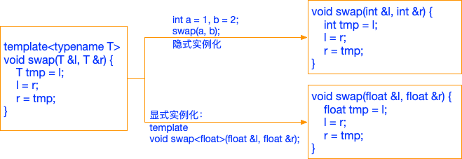
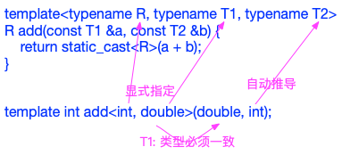
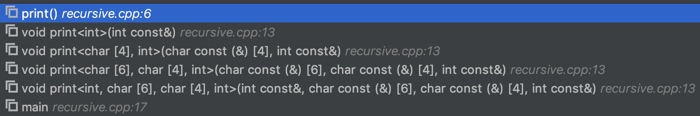

# 函数模板

# 一、为什么要有函数模板
在泛型编程出现前，我们要实现一个swap函数得这样写:
```c++
void swap(int &a, int &b) {
    int tmp{a};
    a = b;
    b = tmp;
}
```
但这个函数只支持int型的变量交换，如果我们要做float, long, double, std::string等等类型的交换时，只能不断加入新的重载函数。这样做不但代码冗余，容易出错，还不易维护。C++函数模板有效解决了这个问题。函数模板摆脱了类型的限制，提供了通用的处理过程，极大提升了代码的重用性。
# 二、什么是函数模板
[cppreference](https://zh.cppreference.com/w/cpp/language/function_template)中给出的定义是"**函数模板定义一族函数**"，怎么理解呢？我们先来看一段简单的代码
```c++
#include <iostream>

template<typename T>
void swap(T &a, T &b) {
    T tmp{a};
    a = b;
    b = tmp;
}

int main() {
    int a = 2, b = 3;
    swap(a, b);  // 使用函数模板
    std::cout << "a=" << a << ", b=" << b << std::endl;
}
```
swap支持多种类型的通用交换逻辑。它跟普通C++函数的区别在于其函数声明(declaration)前面加了个**template\<typename T\>**，这句话告诉编译器，swap中(函数参数、返回值、函数体中)出现类型T时，不要报错，T是一个通用类型。
函数模板的格式：
```c++
template<parameter-list> function-declaration
```
函数模板在形式上分为两部分：模板、函数。在函数前面加上template<...>就成为函数模板，因此对函数的各种修饰(inline、constexpr等)需要加在function-declaration上，而不是template前。如
```c++
template<typename T>
inline T min(const T &, const T &);
```
**parameter-list**是由英文逗号(,)分隔的列表，每项可以是下列之一：

|序号|名称|说明
|:--:|:--:|--
|1|非类型形参|已知的数据类型，如整数、指针等，C++11中有三种形式: <br/>int N<br/>int N = 1: 带默认值，该值必须是一个常量或常量表达式<br/>int ...N: [模板参数包(可变参数模板)](https://zh.cppreference.com/w/cpp/language/parameter_pack)
|2|类型形参|swap值用的形式，格式为: <br/>typename name[ = default]<br/>typename ... name： [模板参数包](https://zh.cppreference.com/w/cpp/language/parameter_pack)
|3|模板模板形参|没错有两个"模板"，这个比较复杂，有兴趣的同学可以参考<br/>[cppreference之模板形参与模板实参](https://zh.cppreference.com/w/cpp/language/template_parameters)

上面swap函数模板，使用了类型形参。函数模板就像是一种契约，任何满足该契约的类型都可以做为模板实参。而契约就是函数实现中，模板实参需要支持的各种操作。上面swap中T需要满足的契约为：支持拷贝构造和赋值。
```c++
template<typename T>
void swap(T &a, T &b) {
    T tmp{a};  // 契约一：T需要支持拷贝构造
    a = b;     // 契约二：T需要支持赋值操作
    b = tmp;
}
```
# 三、函数模板不是函数
刚才我们提到函数模板用来定义**一族函数**，而不是一个函数。C++是一种强类型的语言，在不知道T的具体类型前，无法确定swap需要占用的栈大小(参数栈，局部变量)，同时也不知道函数体中T的各种操作如何实现，无法生成具体的函数。只有当用具体类型去替换T时，才会生成具体函数，该过程叫做**函数模板的实例化**。当在main函数中调用`swap(a,b)`时，编译器推断出此时`T`为`int`，然后编译器会生成int版的swap函数供调用。所以相较普通函数，函数模板多了生成具体函数这一步。如果我们只是编写了函数模板，但不在任何地方使用它(也不显式实例化)，则编译器不会为该函数模板生成任何代码。



函数模板实例化分为隐式实例化和显式实例化。
## 3.1 隐式实例化
仍以swap为例，我们在main中调用`swap(a,b)`时，就发生了隐式实例化。当函数模板被调用，且在之前没有显式实例化时，即发生函数模板的隐式实例化。如果模板实参能从调用的语境中推导，则不需要提供。
```c++
#include <iostream>

template<typename T>
void print(const T &r) {
    std::cout << r << std::endl;
}
int main() {
    // 隐式实例化print<int>(int)
    print(1);
    // 实例化print<char>(char)
    print<>('c');
    // 仍然是隐式实例化，我们希望编译器生成print<double>(double)
    print<double>(1);
}
```

## 3.2 显式实例化
在**函数模板定义后**，我们可以通过显式实例化的方式告诉编译器生成指定实参的函数。显式实例化声明会阻止隐式实例化。
```c++
template<typename R, typename T1, typename T2>
R add(T1 a, T2 b) {
    return static_cast<R>(a + b);
}
// 显式实例化
template double add<double, int, double>(int, double);
// 显式实例化, 推导出第三个模板实参
template int add<int, int>(int, int);
// 全部由编译器推导
template double add(double, double);
```
如果我们在显式实例化时，只指定**部分模板实参**，则指定顺序必须自左至右依次指定，不能越过前参模板形参，直接指定后面的。



# 四、函数模板的使用
## 4.1 使用非类型形参
```c++
#include <iostream>

// N必须是编译时的常量表达式
template<typename T, int N>
void printArray(const T (&a)[N]) {
    std::cout << "[";
    const char *sep = "";
    for (int i = 0; i < N; i++, (sep = ", ")) {
        std::cout << sep << a[i];
    }
    std::cout << "]" << std::endl;
}

int main() {
    // T: int, N: 3
    printArray({1, 2, 3});
}
//输出：[1, 2, 3]
```

## 4.2 返回值为auto
有些时候我们会碰到这样一种情况，函数的返回值类型取决于函数参数某种运算后的类型。对于这种情况可以采用**auto**关键字作为返回值占位符。
```c++
template<typename T1, typename T2>
auto multi(T a, T b) -> decltype(a * b) {
    return a * b;
}
```
**decltype**操作符用于查询表达式的数据类型，也是C++11标准引入的新的运算符，其目的是解决泛型编程中有些类型由模板参数决定，而难以表示的问题。为何要将返回值后置呢？
```c++
// 这样是编译不过去的，因为decltype(a*b)中，a和b还未声明，编译器不知道a和b是什么。
template<typename T1, typename T2>
decltype(a*b) multi(T a, T b) {
    return a*+ b;
}
//编译时会产生如下错误：error: use of undeclared identifier 'a'
```

## 4.3 类成员函数模板
函数模板可以做为类的成员函数。
```c++
#include <iostream>

class object {
public:
    template<typename T>
    void print(const char *name, const T &v) {
        std::cout << name << ": " << v << std::endl;
    }
};

int main() {
    object o;
    o.print("name", "Crystal");
    o.print("age", 18);
}
```
输出:
```
name: Crystal
age: 18
```
需要注意的是：*函数模板不能用作虚函数*。这是因为C++编译器在解析类的时候就要确定虚函数表(vtable)的大小，如果允许一个虚函数是函数模板，那么就需要在解析这个类之前扫描所有的代码，找出这个模板成员函数的调用或显式实例化操作，然后才能确定虚函数表的大小，而显然这是不可行的。
## 4.4 函数模板重载
函数模板之间、普通函数和模板函数之间可以重载。编译器会根据调用时提供的函数参数，调用能够处理这一类型的最佳匹配版本。在匹配度上，一般按照如下顺序考虑： 
|顺序|行为
|:--:|--
|1|最符合函数名和参数类型的**普通函数**
|2|特殊模板（具有非类型形参的模板，即对T有类型限制）
|3|普通模板（对T没有任何限制的）
|4|通过类型转换进行参数匹配的重载函数
```c++
#include <iostream>

template<typename T>
const T &max(const T &a, const T &b) {
    std::cout << "max(&, &) = ";
    return a > b ? a : b;
}

// 函数模板重载
template<typename T>
const T *max(T *a, T *b) {
    std::cout << "max(*, *) = ";
    return *a > *b ? a : b;
}

// 函数模板重载
template<typename T>
const T &max(const T &a, const T &b, const T &c) {
    std::cout << "max(&, &, &) = ";
    const T &t = (a > b ? a : b);
    return t > c ? t : c;
}

// 普通函数
const char *max(const char *a, const char *b) {
    std::cout << "max(const char *, const char *) = ";
    return strcmp(a, b) > 0 ? a : b;
}

int main() {
    int a = 1, b = 2;
    std::cout << max(a, b) << std::endl;
    std::cout << *max(&a, &b) << std::endl;
    std::cout << max(a, b, 3) << std::endl;
    std::cout << max("en", "ch") << std::endl;
    // 可以通过空模板实参列表来限定编译器只匹配函数模板
    std::cout << max<>("en", "ch") << std::endl;
}
```
输出
```commandline
max(&, &) = 2
max(*, *) = 2
max(&, &, &) = 3
max(const char *, const char *) = en
max(*, *) = en
```
可以通过空模板实参列表来限定编译器只匹配函数模板，比如main函数中的最后一条语句。

## 4.5 函数模板特化
当函数模板需要对某些类型进行特别处理，这称为函数模板的特化。当我们定义一个特化版本时，函数参数类型必须与一个先前声明的模板中对应的类型匹配。函数模板特化的本质是实例化一个模板，而非重载它。因此，特化不影响编译器函数匹配。
```c++
template<typename T1, typename T2>
int compare(const T1 &a, const T2 b) {
    return a - b;
}
// 对const char *进行特化
template<>
int compare(const char * const &a, const char * const &b) {
    return strcmp(a, b);
}
```
上面的例子中针对const char \*的特化，我们其实可以通过函数重载达到相同效果。因此对于函数模板特化，目前公认的观点是**没什么用，并且最好别用**。[Why Not Specialize Function Templates?](http://www.gotw.ca/publications/mill17.htm)

但函数模板特化和重载在[重载决议](https://zh.cppreference.com/w/cpp/language/overload_resolution)时有些细微的差别。这些差别中比较有用的一个是阻止某些隐式转换。如当你只有void foo(int)时，以浮点类型调用会发生隐式转换，这可以通过特化来阻止：
```c++
template <class T> void foo(T);
template <> void foo(int) {}
foo(3.0); // link error，阻止float隐式转换为int
```
虽然模板配重载也可以达到同样的效果，但特化版的意图更加明确。
> 函数模板及其特化版本应该声明在同一个头文件中。所有同名模板的声明应该放在前面，然后是这些模板的特化版本。

# 五、变参函数模板(模板参数包)
这是C++11引入的新特性，用来表示任意数量的模板形参。其语法样式如下:
```c++
template<typename ...Args>  // Args: 模板参数包
void foo(Args ...  args);   // args: 函数参数包
```
在模板形参Args的左边出现三个英文点号"..."，表示Args是零个或多个类型的列表，是一个模板参数包(template parameter pack)。正如其名称一样，编译器会将Args所表示的类型列表打成一个包，将其当做一个特殊类型处理。相应的函数参数列表中也有一个*函数参数包*。与普通模板函数一样，编译器从函数的实参推断模板参数类型，与此同时还会推断包中参数的数量。
```c++
// sizeof...() 是C++11引入的参数包的操作函数，用来取参数的数量
template<typename ...Args>
int length(Args ...  args) {
    return sizeof...(Args);
}

// 以下语句将在屏幕打印出：2
std::cout << length(1, "hello") << std::endl;
```
变参函数模板主要用来处理既不知道要处理的实参的数目也不知道它们的类型时的场景。既然我们对实参数量以及类型都一无所知，那么我们怎么使用它呢?最常用的方法是*递归*。
## 5.1 递归
通过递归来遍历所有的实参，这需要一点点的技巧，需要给出终止递归的条件，否则递归将无限进行。
```c++
#include <iostream>

// 递归终止
void print() {    /// 1
    std::cout << std::endl;
}

// 打印绑定到t的实参
template<typename T, typename... Args>
void print(const T &t, const Args &... args) {  /// 2
    std::cout << t << (sizeof...(args) > 0 ? ", " : "");
    // 编译时展开：通过在args右边添加省略号(...)进行展开，打印参数包中剩余的参数
    print(args...);
}

int main() {
    print(1, "hello", "C++", 11);
    return 0;
}
//输出: 1, hello, C++, 11
```
该例子的技巧在于，函数2提供了const T &t参数，保证至少有一个参数，避免了与函数1在args为0时的冲突。需要注意的是，递归是指**编译器递归**，不是运行过程时的递归调用。实际上编译器为函数2生成了4个重载版本，并依次调用。下图是在运行时的调用栈，可以看到共有5个重载版本的print函数，4个递归展开的函数2，外加函数1。递归最终结束在函数1处。



## 5.2 包扩展
对于一个参数包，不管是模板参数包还是函数参数包，我们对它能做的只有两件事：**sizeof...()**和**包扩展**。前面我们说过编译器将参数包当作**一个**类型来处理，因此使用的时候需要将其展开，展开时我们需要提供用于每个元素的处理模式(pattern)。包扩展就是**对参数包中的每一个元素应用模式，获取得扩展后的列表**。最简单的包扩展方式就是我们在上节中看到的`const Args &...`和`args...`，该扩展是将其扩展为构成元素。C++11还支持更复杂的扩展模式，如：
```c++
#include <iostream>
#include <sstream>
#include <string>
#include <vector>

template<typename T>
std::string to_str(const T &r) {
    std::stringstream ss;
    ss << "\"" << r << "\"";
    return ss.str();
}

template<typename... Args>
void init_vector(std::vector<std::string> &vec, const Args &...args) {
    // 复杂的包扩展方式
    vec.assign({to_str(args)...});
}

int main() {
    std::vector<std::string> vec;
    init_vector(vec, 1, "hello", "world");
    std::cout << "vec.size => " << vec.size() << std::endl;
    for (auto r: vec) {
        std::cout << r << std::endl;
    }
}
```
运行程序将产生如下输出：
```
vec.size => 3
"1"
"hello"
"world"
```
扩展过程中模式(pattern)会独立地应用于包中的每一个元素。同时pattern也可以接受多个参数，并非仅仅只能接受参数包。
## 5.3 参数包的转发
C++11中，我们可以同时使用变参函数模板和std::forward机制来编写函数，将实参原封不动地传递给其它函数。其中典型的应用是std::vector::emplace_back操作，有举的读者可以去阅读其源码，在此就不展开讨论了。

# 六、其它
## 6.1 函数模板 .vs. 模板函数
函数模板重点在*模板*。表示这是一个模板，用来生成函数。<br/>模板函数重点在*函数*。表示的是由一个模板生成而来的函数。
## 6.2 [cv限定](https://zh.cppreference.com/w/cpp/language/cv)
cv限定是指函数参数中有const、volatile或mutable限定。已指定、推导出或从默认模板实参获得所有模板实参时，函数参数列表中每次模板形参的使用都会被替换成对应的模板实参。替换后：
 * 所有数组类型和函数类型参数被调整成为指针
 * 所有顶层cv限定符从函数参数被丢弃，如在普通函数声明中。

顶层cv限定符的去除不影响参数类型的使用，因为它出现于函数中：
```c++
template <typename T> void f(T t);
template <typename X> void g(const X x);
template <typename Z> void h(Z z, Z *zp);

// 两个不同函数有同一类型，但在函数中， t有不同的cv限定
f<int>(1);       // 函数类型是 void(int) ， t 为 int
f<const int>(1); // 函数类型是 void(int) ， t 为 const int

// 二个不同函数拥有同一类型和同一 x
// （指向此二函数的指针不相等，且函数局域的静态变量可以拥有不同地址）
g<int>(1);       // 函数类型是 void(int) ， x 为 const int
g<const int>(1); // 函数类型是 void(int) ， x 为 const int

// 仅丢弃顶层 cv 限定符：
h<const int>(1, NULL); // 函数类型是 void(int, const int*) 
                       // z 为 const int ， zp 为 int*
```
