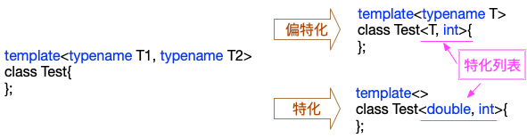

# C++11泛型 - 类模板
前面我们介绍了[函数模板](09-generic_function.MD)。今天我们来看看C++的另一种泛型：类模板。C++中类模板通常是容器(如std::vector)或行为的封装(如之前我们实现的chan<T>类)。类模板语法：
```c++
template < parameter-list > class-declaration
```
构成类模板的形参(parameter-list)约束与函数模板相同，此处就不赘述了。与函数模板的类型自动推演不同，类模板实例化时，需要显式指定:
```c++
std::vector<int> intArr;
```
# 一、成员函数
与函数模板一样，类模板只是定义了一组通用的操作，在具体实例化前是不占用程序空间的。这种Lazy特性在类模板中得到了进一步地加强：**成员函数(含成员函数模板)只有在使用时才生成**。
```c++
template<typename T>
class A {
    T a_;
public:
    void add(int n) {
        a_ += n;
    }
};

class M{};

int main() {
    A<M> s;      // s未用到add函数，因此整个程序得以成功编译
   // s.add(1);  // 如果有这句话，则会编译失败
}
```
本例中，A<T>::add在变量s中未使用到，因此虽然a_ += n不合法，但整个程序仍然通过了编译。

## 1.1 虚函数
在函数模板中我们提到*虚函数*不能是函数模板，那么在类模板中可以有虚函数吗？答案是肯定的，类模板中可以有虚函数，虚函数在类模板实例化为模板类时由编译器生成，因此其实现必须是合法的，否则即使未被使用到，也会编译失败。类模板的虚函数可以访问模板类中的泛型成员(变量、成员函数模板都可以访问)。
```c++
#include <iostream>
template<typename T>
class A {
    T a_;
public:
    virtual void say() {
        std::cout << "a -> " << a_ << std::endl;
    }
};

class M{};

int main() {
    // 尽管say函数未被使用，此处会编译仍会失败，因为std::cout << m.a_操作是非法的
    A<M> m;
}
```
## 1.2 成员函数模板
类模板和函数模板结合就是成员函数模板。
```c++
#include <iostream>
template<typename T>
class Printer {
    T prefix_;
public:
    explicit Printer(const T &prefix):prefix_(prefix){
    }
    // 成员函数模板
    template<typename U, typename ...Args> void print(const U &u, Args... args);
    void print() {
        std::cout << std::endl;
    }
};

template<typename T> template<typename U, typename ...Args>
void Printer<T>::print(const U &u, Args... args) {
    std::cout << this->prefix_ << u << std::endl;
    print(args...);
}
```
# 二、类模板特化与偏特化
模板特化是指定类模板的**特定实现**。是针对某类型参数的特殊化处理。假设我们有一个类模板Stack<T>，它有一个功能：min(取Stack的最小值)，则该类模板的典型实现如下：
```c++
template<typename T>
struct StackItem {
    StackItem *next;
    T item;
};
template<typename T>
class Stack {
    StackItem<T> *front = nullptr;
public:
    T min() const {
        assert(front != nullptr);
        T min = front->item;
        for (StackItem<T> *it = front->next; it != nullptr; it = it->next) {
            if (it->item < min) {
                min = it->item;
            }
        }
        return min;
    }
};
```
Stack<T>::min所需满足的契约是：T需支持小于操作(operator <)。但有些类型无法满足该要求，如const char *。如果Stack<T>要支持const char *的话，则需要特化。
```c++
template<>
class Stack<const char *>  // 类名后面，跟上<...>，则表明是特化
{
    StackItem<const char *> *front = nullptr;
public:
    const char * min() const {
        assert(front != nullptr);
        const char * min = front->item;
        for (StackItem<const char *> *it = front->next; it != nullptr; it = it->next) {
            if (strcmp(it->item, min) < 0) {
                min = it->item;
            }
        }
        return min;
    }
};
```
## 2.1 偏特化
偏特化也叫部分特化，指的是当类模板有一个以上模板参数时，我们希望能对某个或某几个模板实参进行特化。类模板的特化(或偏特化)只需要*模板名称相同*并且*特化列表<>中的参数个数与原始模板对应*上即可，模板参数列表不必与原始模板相同模板名称相同。一个类模板可以有多个特化，与函数模板相同，编译器会自动实例化那个最特殊的版本。



完全特化的结果是一个实际的class，而偏特化的结果是另外一个同名的模板。

# 三、类模板中的static成员
类模板中可以声明static成员。但需要注意的是**每个不同模板实例都会有一个独立的static成员变量**。
```c++
template<typename T>
class A {
public:
    static int count;
};
template<typename T> int A<T>::count = 1;
```
则`A<int>::count`与`A<double>::count`是不同的两个变量。
## 3.1 类模板中static成员的特化
static成员也可以进行特化
```c++
// template<typename T> A {...};  // 见上面的定义
template<> int A<const char *>::count = 100;
```
则A<const char *>::count的值被值始化为100，而以其它类型进行实例化时则初始化为1。

# 四、友元
友元在C++中做为一个**BUG**式的存在，可以授权“好友”访问其隐私数据。
```c++
template<typename T> class A;  //  前置声明，在B中声明友元需要的

template<typename U>
class B {
    // 每个B的实例将授权相同类型实例化的A
    friend class A<U>;
    // C的所有实例都是B的友元，该种情况下C无需前置声明
    template<typename T> fiend class C;
    // 普通类
    friend class D;
    // 模板自己的类型参数成为友元
    friend U;
};
```
# 五、总结
本节简单介绍了类模板，由于篇幅限制不能一一展开，如有疏漏欢迎批评指正。
